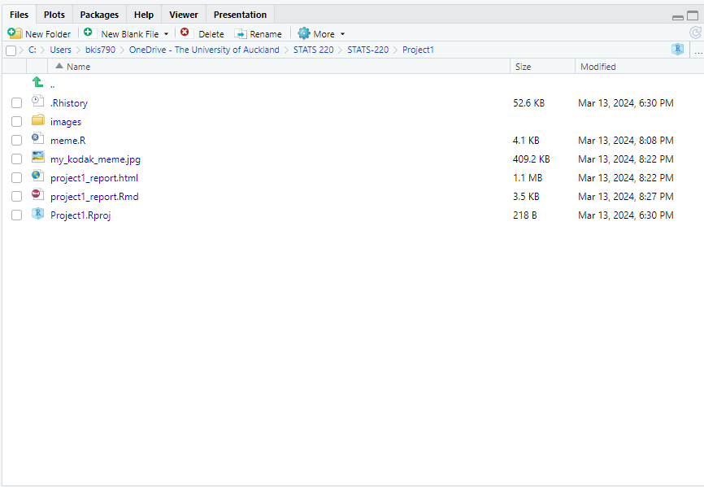
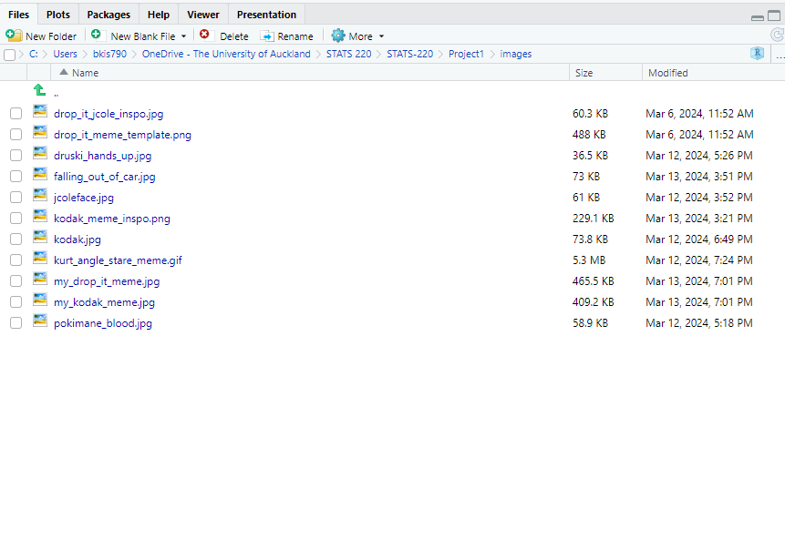
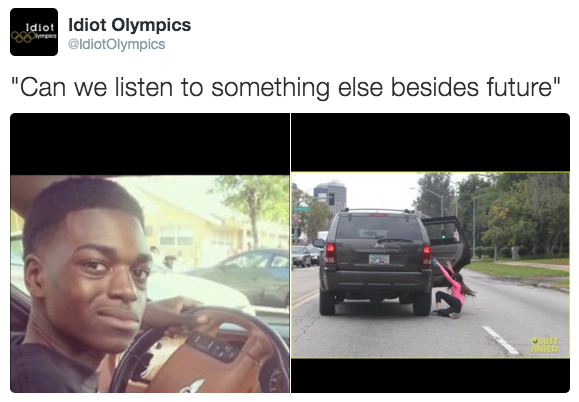
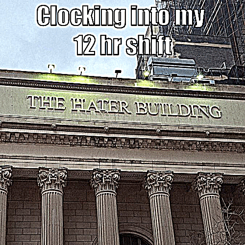

```{r setup, include=FALSE}
knitr::opts_chunk$set(echo=TRUE, message=FALSE, warning=FALSE, error=FALSE)
library(magick)
```

```{css}
body {
    font-size: 12pt;
    font-family: 'Cascadia Code', sans-serif;
    background-color: #CCC1B7;
}

pre {

    background-color: #fff1e5;
    padding: 5px;
}
```

## Project requirements
The requirements related to working with GitHub have been met as a repository called [STATS 220](https://github.com/s33yuh/STATS-220.git) containing a README.md file has been created. This README file outlines the purpose of the repository as well as providing a summary of the current project and a link to the project 1 instructions.

In doing so the README file demonstrates the use of the following Markdown syntax:

* two different levels of headers
* the use of bold and italic text
* the use of both ordered and unordered lists
* the use of links to other websites

My STATS 220 repository now contains the R project directory for project 1, which in turn contains all files pertaining to project 1, including the R Markdown file, the R script file etc. as shown below:





## My meme

The meme from which I took inspiration: 


```{r meme-code, eval=TRUE, fig.align="center"}
# load Kodak Black face image 
kodak_face <- "images/kodak.jpg" %>%
              image_read() %>%
              # scale and crop image
              image_crop("400x300") %>%
              image_scale("286") %>%
              # modulate image to add character
              image_modulate(saturation = 130, brightness = 110, hue = 110) %>%
              # add thin yellow border
              image_border("yellow", "1x1")
              
# load person falling out of car image (slightly different from inspo)
thrown_out <- "images/falling_out_of_car.jpg" %>%
              image_read() %>%
              # crop and scale image
              image_crop("600x350+50") %>%
              image_scale("286") %>%
              # modulate image to add character
              image_modulate(saturation = 150, brightness = 110, hue = 110) %>%
              # add thin yellow border
              image_border("yellow", "1x1")
                  


# create image boxes and add meme images onto them
kodak_box <- image_blank(290, 290, "black") %>%
             image_composite(kodak_face, offset = "+1+40")
thrown_out_box <- image_blank(290, 290, "black") %>%
                  image_composite(thrown_out, offset = "+1+60")


# create meme box and add meme text
text_box <- image_blank(500, 350, "white") %>%
  image_annotate("\"Can we listen to some J. cole\"", 
                 gravity = "north", location = "+0+15",
                 weight = 500, size = 30, font = "sans")

# append both meme images
kodak_meme_body <- c(kodak_box, thrown_out_box) %>%
                   image_append() %>%
                   image_scale("490")

# combine text box and image box
kodak_meme <- text_box %>% 
              image_composite(kodak_meme_body, offset = "+5+70") %>%
              # "deep fry" meme by sharpening using convolution
              image_convolve('DoG:0,0,2', scaling = '100, 20%') 
              
              
  
# write finished meme to .jpg file
image_write(kodak_meme, "my_kodak_meme.jpg")

# display meme in R markdown document
kodak_meme

```

The original meme was in the form of a tweet with text on a white background on the top and a lower panel of the two images side by side on a black background. I sourced both the images used in the original, namely the head shot of the famous rapper Kodak Black and a photo of a lady falling out of a car from the internet. Once I had cropped both images to similar proportions,I used the magick function "image_modulate" to adjust the contrast, brightness, and hue of both images to recreate the original. Then, both images were placed on their respective black backgrounds and set side by side. From there I place them onto the a white background with text. Aside from the lack of the profile picture and profile handle found on my inspiration meme, as well as some minor geometrical differences, my meme now recreated most of the fundamental features of the original.

As for the features I changed, I decided to modify the original text to something I would find humourous and to make this meme personal. The original meme had the text "Can we listen to something else besides future" which I changed to "Can we listen to J. Cole" on my rendition. The font and size of the text were also different to the original

On the completed meme, I also used the magick function "image_convolute" to create the so-called "deep fried" effect commonly found on memes to add character, thereby adding another change.


```{r animation-code, eval=FALSE, fig.align="center"}
# create drop it meme
drop_it_meme <- "images/drop_it_meme_template.png" %>%
  
  # read image
  image_read() %>%
  # crop image
  image_crop("500x490+0+100") %>%
  
  # add meme text
  image_annotate("J. Cole", gravity = "northwest", location = "+30+10",
                 color = "white", size = 50, weight = 700, font = "sans", 
                 boxcolor = "black") %>%
  image_annotate("in the", gravity = "north", location = "+40",
                 color = "white", strokecolor = "black", strokewidth = 3,
                 size = 50, weight = 700, font = "Impact", kerning = -1) %>%
  image_annotate("studio like", gravity = "north", location = "-80+80",
                 color = "white", strokecolor = "black", strokewidth = 3,
                 size = 50, weight = 700, font = "Impact", kerning = -1) %>%
  image_annotate("drop it", gravity = "south", location = "+0+10",
                 color = "white", strokecolor = "black", strokewidth = 3,
                 size = 50, weight = 700, font = "Impact", kerning = -1) %>%
  image_annotate("yeah this", gravity = "center", location = "-100+80",
                 color = "white", strokecolor = "black", strokewidth = 3,
                 size = 50, weight = 700, font = "Impact", kerning = -1) %>%
  image_annotate("sounds", gravity = "center", location = "+80+80",
                 color = "white", 
                 size = 45, weight = "700", kerning = -1) %>%
  image_annotate("boring as fuck", gravity = "center", location = "+40+130",
                 color = "white", 
                 size = 45, weight = "700", kerning = -1) %>%
  
  
  # "deep fry" meme by sharpening using convolution
  image_convolve('DoG:0,0,2', scaling = '100, 20%')

# stare meme
stare_meme <- "images/kurt_angle_meme.jpg" %>%
              image_read() %>%
              image_scale("500") %>%
              image_crop("300x400+100") %>%
              image_scale("500") %>%
              image_quantize(colorspace = 'gray') %>%
              image_annotate("When the DJ starts ", gravity = "north",
                             location = "", color = "white", 
                             strokecolor = "black", strokewidth = 2,
                             size = 50, weight = 700, font = "Impact", 
                             boxcolor = "black") %>%
              image_annotate("playing J.cole", gravity = "north", 
                            location = "+0+60",
                            color = "white", strokecolor = "black", 
                            strokewidth = 2, size = 50, weight = 700, 
                            font = "Impact", boxcolor = "black") %>%
              image_convolve('DoG:0,0,2', scaling = '100, 20%')


# hater building meme
hater_building_meme <- "images/hater_building.jpg" %>%
                        image_read() %>%
                        image_scale("500") %>%
                        image_crop("500x500") %>%
                        image_annotate("Clocking into my ", gravity = "north",
                                       location = "", color = "white", 
                                       strokecolor = "black", strokewidth = 2,
                                       size = 50, weight = 700, 
                                       font = "Impact") %>%
                        image_annotate("12 hr shift", gravity = "north", 
                                       location = "+0+60",
                                       color = "white", strokecolor = "black", 
                                       strokewidth = 2, size = 50, weight = 700, 
                                       font = "Impact") %>%
                        image_convolve('DoG:0,0,2', scaling = '100, 20%')

# animation

frames <- c(hater_building_meme, stare_meme, kodak_meme, drop_it_meme, 
            hater_building_meme)
my_gif <- image_animate(image_scale(frames, "500x500"), fps = 0.25, 
                        dispose = "previous")

# save gif
image_write(my_gif, "my_gif.gif")

```





## Creativity

I have shown creativity in my project by going beyond what was taught in the lectures. For example, when creating my meme I used the function "image_convolute" from the magick library to create the "deep fried" effect on my meme by changing the hue, brightness, and saturation of the image. 

As well as this I used the function "image_compose" to layer multiple images in different positions, and "image_quantize" to turn my image black and white. For the css, I changed both the background colour for the whole HTML document as well as the background colour of the code blocks. 

Finally, in making my animated gif, I believe I demonstrated creativity by curating each frame as well as the order of the frames so as to tell a story.

## Learning reflection

An important idea I have learned through working on module 1 of this course is how R and it's myriad of libraries allows us to work with all sorts of media. Specifically, while using the "magick" library, I learned how to manipulate and create my own images as well as animations and subsequently append those images and animations to an R Markdown document to be knitted into HTML. 

In addition, I learnt to use pipes; although I had been using R for years, I had never properly utilised pipes in my programs until working on this project.

Finally, I would like to learn more about how data gets acquired, stored, and retrieved, and how the size of the data impacts the methods used at each of those stages.

